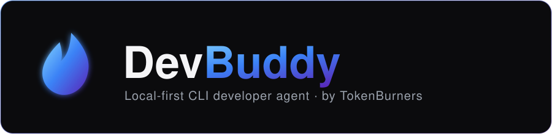

<p align="center">
  
</p>

# DevBuddy Agent 🔥

<p align="center">
  <a href="https://github.com/Gautam-Shah-14/DevBuddy/blob/main/LICENSE"></a>
  <a href="https://github.com/Gautam-Shah-14/DevBuddy"></a>
  <a href="README.md"></a>
  <a href="README.ur-pk.md"></a>
</p>

**由 TokenBurners 构建的本地优先（local-first）自进化 AI 代理**，基于
[Hermes Agent](https://github.com/NousResearch/hermes-agent)（Nous Research，MIT 许可）
构建。它从经验中创建技能，在使用中改进技能，主动持久化知识，搜索过往对话，并在跨会话中逐步
构建对你的深度理解。完全在你自己的机器上运行，连接你自己的本地 Ollama——无需 API Key、无需
云端调用——如果你愿意，也可以连接 OpenAI/Anthropic/任何兼容 OpenAI 的端点。

使用 `devbuddy model` 即可切换服务商/模型——无需改代码，无锁定。

<table>
<tr><td><b>真正的终端界面</b></td><td>完整的 TUI，支持多行编辑、斜杠命令自动补全、对话历史、中断重定向和流式工具输出。</td></tr>
<tr><td><b>随你所在</b></td><td>Telegram、Discord、Slack、WhatsApp、Signal 和 CLI——全部从单个网关进程运行。语音备忘录转写、跨平台对话连续性。</td></tr>
<tr><td><b>闭环学习</b></td><td>代理管理记忆并定期自我提醒。复杂任务后自动创建技能。技能在使用中自我改进。FTS5 会话搜索配合 LLM 摘要实现跨会话回溯。兼容 <a href="https://agentskills.io">agentskills.io</a> 开放标准。</td></tr>
<tr><td><b>定时自动化</b></td><td>内置 cron 调度器，支持向任何平台投递。日报、夜间备份、周审计——全部用自然语言描述，无人值守运行。</td></tr>
<tr><td><b>委派与并行</b></td><td>生成隔离子代理处理并行工作流。编写 Python 脚本通过 RPC 调用工具，将多步管道压缩为零上下文开销的轮次。</td></tr>
<tr><td><b>默认本地优先</b></td><td>无需 Docker、无需服务器、无需 API Key 即可开始——`devbuddy` 直接连接你的本地 Ollama。Docker 及另外六种终端后端（SSH、Singularity、Modal、Daytona、Vercel Sandbox）仅在你需要隔离/远程执行时才会用到，并非必需。</td></tr>
</table>

---

## 快速安装

> **Docker 是可选的，并非必需。** `devbuddy` 是一个纯 Python 控制台脚本——它直接在你的机器
> 上运行，连接你自己的本地 Ollama（或 OpenAI/Anthropic/任何服务商），完全不需要容器。本仓库
> 中的 `docker-compose.yml` 仅用于启动 *gateway* 和 *dashboard* 服务（常驻的消息平台桥接和
> 网页界面），适合希望它作为后台服务运行、可从 Telegram、Discord 等平台访问的用户。如果你只
> 想在终端里和它对话，完全可以跳过 Docker。

本仓库目前还没有托管安装脚本——请从源码运行：

```bash
git clone https://github.com/Gautam-Shah-14/DevBuddy.git && cd DevBuddy
source ./activate      # 配置并激活本地 Python/Node 环境（无需 Docker）
devbuddy                # 开始对话——默认连接你的本地 Ollama
```

`source ./activate` 需要 Python 3.14（项目真正依赖的版本——更低版本完全无法解析其依赖）
和 Node.js；`AGENTS.md` 中有 PM 工具管理器的完整工作流说明（激活、日常使用、依赖变更、运行
测试）。

### Windows / Android

旧的托管一键安装脚本（`install.sh` / `install.ps1`、Termux 的 APT 仓库）指向 Nous Research
自己的域名，目前还不适用于本 fork。原生 Windows 和 Termux/Android 都可以通过上面的源码安装
方式运行；只是这里暂时还没有对应的一键安装包。

---

## 快速入门

```bash
devbuddy              # 交互式 CLI — 开始对话
devbuddy model        # 选择 LLM 提供商和模型
devbuddy tools        # 配置启用的工具
devbuddy config set   # 设置单个配置项
devbuddy config get   # 打印单个配置项
devbuddy gateway      # 启动消息网关（Telegram、Discord 等）
devbuddy setup        # 运行完整设置向导（一次性配置所有内容）
devbuddy claw migrate # 从 OpenClaw 迁移（如果来自 OpenClaw）
devbuddy update       # 更新到最新版本
devbuddy doctor       # 诊断问题
```

### 数据与配置位置

所有本地状态——`config.yaml`、`.env` 密钥、会话数据库、技能、日志、命名配置文件——都存放在
`~/.devbuddy`（原生 Windows 上是 `%LOCALAPPDATA%\devbuddy`）。这由代码中唯一一处控制
（`devbuddy_constants._get_platform_default_hermes_home()`）；`HERMES_HOME` 环境变量依然和
以前一样可以覆盖这个位置，如果你想把数据存到别的地方（另一个磁盘、同步文件夹、容器卷等）：

```bash
export HERMES_HOME=/path/to/your/data   # 可选覆盖；默认 ~/.devbuddy
devbuddy doctor                          # 确认当前读写位置
```

`devbuddy doctor` 和 `devbuddy profile list` 都会打印当前生效的 home 路径，方便你确认数据
实际落在哪里。

---

## CLI 与消息平台 快速对照

DevBuddy 有两种入口：用 `devbuddy` 启动终端 UI，或运行网关从 Telegram、Discord、Slack、
WhatsApp、Signal 或 Email 与之对话。进入对话后，许多斜杠命令在两种界面中通用。

| 操作 | CLI | 消息平台 |
|------|-----|----------|
| 开始对话 | `devbuddy` | 运行 `devbuddy gateway setup` + `devbuddy gateway start`，然后给机器人发消息 |
| 开始新对话 | `/new` 或 `/reset` | `/new` 或 `/reset` |
| 更换模型 | `/model [provider:model]` | `/model [provider:model]` |
| 设置人格 | `/personality [name]` | `/personality [name]` |
| 重试或撤销上一轮 | `/retry`、`/undo` | `/retry`、`/undo` |
| 压缩上下文 / 查看用量 | `/compress`、`/usage`、`/insights [--days N]` | `/compress`、`/usage`、`/insights [days]` |
| 浏览技能 | `/skills` 或 `/<skill-name>` | `/skills` 或 `/<skill-name>` |
| 中断当前工作 | `Ctrl+C` 或发送新消息 | `/stop` 或发送新消息 |
| 平台特定状态 | `/platforms` | `/status`、`/sethome` |

---

## 文档

本 fork 目前还没有自己的文档站点。[Hermes Agent 自己的文档](https://hermes-agent.nousresearch.com/docs/)
仍是大多数功能（CLI 使用、配置、消息网关、工具/工具集、技能、记忆、MCP、定时任务）的最佳
参考——本 fork 的代理核心、CLI 和网关底层仍然是 Hermes Agent，只是改了名字，并且默认指向
`~/.devbuddy` 而不是 `~/.hermes`。本仓库中的 `AGENTS.md` 是本 fork 自身代码结构和约定的权威
参考。

---

## 从 OpenClaw 迁移

如果你来自 OpenClaw，DevBuddy 可以自动导入你的设置、记忆、技能和 API 密钥。

**首次安装时：** 安装向导（`devbuddy setup`）会自动检测 `~/.openclaw` 并在配置开始前提供
迁移选项。

**安装后任意时间：**

```bash
devbuddy claw migrate              # 交互式迁移（完整预设）
devbuddy claw migrate --dry-run    # 预览将要迁移的内容
devbuddy claw migrate --preset user-data   # 仅迁移用户数据，不含密钥
devbuddy claw migrate --overwrite  # 覆盖已有冲突
```

导入内容：
- **SOUL.md** — 人格文件
- **记忆** — MEMORY.md 和 USER.md 条目
- **技能** — 用户创建的技能 → `~/.devbuddy/skills/openclaw-imports/`
- **命令白名单** — 审批模式
- **消息设置** — 平台配置、允许用户、工作目录
- **API 密钥** — 白名单中的密钥（Telegram、OpenRouter、OpenAI、Anthropic、ElevenLabs）
- **TTS 资产** — 工作区音频文件
- **工作区指令** — AGENTS.md（使用 `--workspace-target`）

使用 `devbuddy claw migrate --help` 查看所有选项，或使用 `openclaw-migration` 技能进行交互式
代理引导迁移（含干运行预览）。

---

## 关于本 fork

这是 DevBuddy 项目的一次从零重写（此前是一个独立的 TypeScript CLI）：不再继续扩展那个较小
的代码库，而是构建在 Hermes Agent 自身（规模更大、MIT 许可）的代理平台之上，重新命名并默认
指向 `~/.devbuddy`。目前还没有把 Hermes 自身的品牌痕迹从代码的每个角落清理干净——注释、少数
第三方集成的默认标识符，以及 Hermes 的文档站点，仍有一些地方写着 "Hermes"。模块结构
（`devbuddy_cli/`、`devbuddy_constants.py`、`devbuddy_state*.py` 等）、`devbuddy` 命令、默认
数据路径，以及启动横幅/主题，都已经真正完成重命名并经过验证。

这是闭源开发软件——目前不接受外部贡献。

---

## 许可证

MIT — 详见 [LICENSE](LICENSE)。基于 [Hermes Agent](https://github.com/NousResearch/hermes-agent)
（MIT，Nous Research）构建。本 fork 由 TokenBurners 制作。
